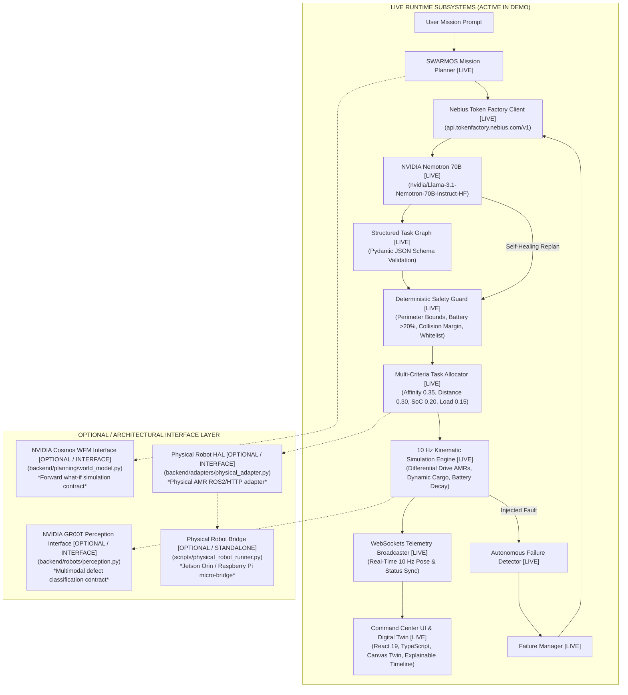
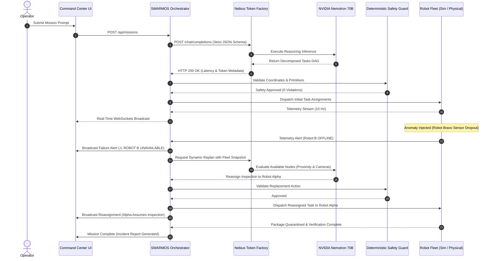

# SWARMOS Architecture Specification

> **"One nervous system for an entire robot fleet."**  
> Physical AI Track — Nebius x NVIDIA Global AI Hackathon 2026

---

## 1. System Overview

SWARMOS is an orchestration layer for heterogeneous physical robot fleets. Rather than treating individual robots as isolated agents, SWARMOS provides a centralized, fault-tolerant nervous system that transforms complex natural-language operational missions into deterministic, safe, physical robot execution.

The core breakthrough is **Self-Healing Swarm Orchestration**: when physical robots experience motor stalls, sensor anomalies, battery depletion, or spatial blocks, SWARMOS detects the condition in real time, invokes **NVIDIA Nemotron** via **Nebius Token Factory** to compute an optimal reassignment, validates the new plan against deterministic physical and safety invariants, and resumes mission execution without human intervention.



---

## 2. End-to-End Dataflow & State Transitions

The execution lifecycle of a mission follows a closed-loop reactive pipeline:

1. **Mission Ingestion**: The operator inputs a mission goal (e.g., *"Inspect Warehouse Zone B, identify damaged packages, move them to quarantine, and generate an incident report"*).
2. **Nemotron Decomposition**: NVIDIA Nemotron decomposes the natural language goal into a Directed Acyclic Graph (DAG) of atomic robotic tasks with typed actions, spatial target zones, and explicit dependency constraints.
3. **Safety Verification**: The Safety Guard verifies that all proposed action primitives belong to the strict whitelist (`navigate`, `inspect`, `transport`, `stop`, `report_status`, `return_to_base`), and that coordinates are strictly within warehouse perimeter boundaries.
4. **Deterministic Allocation**: The multi-criteria allocator scores available robots across capability matching ($w=0.35$), proximity ($w=0.30$), state of charge ($w=0.20$), and current workload ($w=0.15$).
5. **Execution & Telemetry**: Tasks are dispatched across the fleet via the Hardware Abstraction Layer. Positions, headings, velocity vectors, and battery drain are computed and streamed over WebSockets to the digital twin.
6. **Hero Self-Healing Loop**: If a robot encounters a failure (e.g. Robot Bravo's optical sensor links drop):
   - Anomaly is classified (`robot_unavailable`, `obstacle_detected`, or `low_battery`).
   - Active tasks assigned to the failed robot are quarantined.
   - Nemotron reasons over remaining healthy nodes and computes dynamic reassignments.
   - Safety constraints verify replacement trajectories.
   - Reassigned tasks are dispatched immediately, allowing the mission to complete seamlessly.



---

## 3. Hardware Abstraction Layer (HAL)

SWARMOS decouples high-level mission intelligence from low-level robot firmware through a clean Hardware Abstraction Layer:

```
                  ┌────────────────────────┐
                  │      RobotAdapter      │ (Abstract Base Class)
                  └───────────┬────────────┘
                              │
             ┌────────────────┴────────────────┐
             │                                 │
┌────────────▼───────────┐        ┌────────────▼───────────┐
│ SimulationRobotAdapter │        │  PhysicalRobotAdapter  │
└────────────┬───────────┘        └────────────┬───────────┘
             │                                 │
     Deterministic 2D                  ROS2 / Micro-ROS
     Warehouse Kinematics             or HTTP/MQTT Bridge
     (x, y, heading, SoC)             (TurtleBot4, Jetson Orin)
```

### Standardized Interface Methods:
- `connect() -> bool`: Establishes communication link with telemetry bus.
- `get_state() -> RobotState`: Returns operational state (`IDLE`, `NAVIGATING`, `INSPECTING`, `TRANSPORTING`, `OFFLINE`).
- `get_battery() -> float`: Returns State of Charge percentage.
- `get_position() -> Position`: Returns $(x, y, z)$ spatial coordinates in meters.
- `get_sensor_data() -> Dict[str, Any]`: Returns LIDAR range, camera status, and odometry error.
- `navigate(target_pos) -> bool`: Dispatches waypoint navigation primitive.
- `stop() -> bool`: Triggers emergency deceleration halt.
- `execute_task(task) -> bool`: Executes high-level composite task.
- `report_failure(type, desc)`: Signals hardware anomaly to the orchestrator.

---

## 4. NVIDIA Physical AI Extension Interfaces

### 4.1 NVIDIA Cosmos World Foundation Model Interface
Located at [`backend/planning/world_model.py`](file:///Users/bhaveshsuthar/Desktop/NVIDIA/backend/planning/world_model.py):
- Evaluates candidate plans in forward "what-if" simulations.
- Assesses collision likelihoods, choke points, and battery margin depletion before committing AMR trajectories.
- Implements `NVIDIACosmosWorldModelInterface` ready for binding with NVIDIA Cosmos World Foundation Models (WFMs) as endpoint infrastructure becomes available.

### 4.2 NVIDIA Project GR00T Robot Foundation Model Interface
Located at [`backend/robots/perception.py`](file:///Users/bhaveshsuthar/Desktop/NVIDIA/backend/robots/perception.py):
- Provides onboard visual defect detection and package classification.
- Implements `GR00TFoundationModelInterface` for future zero-shot multimodal manipulation and low-level actuation policies via NVIDIA Isaac Lab.
